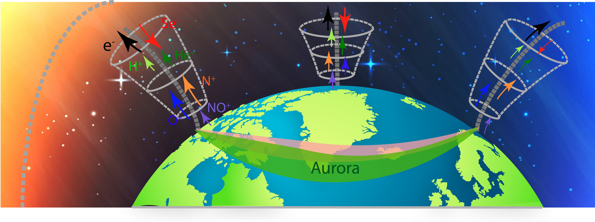


  You can also find my articles on <u><a href="{{author.googlescholar}}">my Google Scholar profile</a>.</u>




## Peer-Reviewed Publications

_[GRL, 2020]_ **M-Y. Lin**, R. Ilie, A. Glocer, **[The Contribution of N+ Ions to Earth’s Polar Wind](https://yilerat19.github.io/publication/2020-lin-2020GL089321)**

_[ASEE, 2021]_ R. Ilie, E. Shaffer, C. M. D’Angelo, D. Cermak, **M. Lin**, H. Chen, **[Virtual Reality Laboratory Experiences for Electricity and Magnetism Courses](https://yilerat19.github.io/publication/2021-ilie-VR)**

_[Submitted]_ **M-Y. Lin**, R. Ilie, [A review of observation of molecular ions in the Earth’s magnetosphereionosphere system](https://yilerat19.github.io/publication/2021-lin-preprint)

## Non Peer-Reviewed Publications

_[Master Thesis]_ **M-Y. Lin**, **[Determining the role of neglected N+ heavy ions in the earth’s inner magnetosphere](https://yilerat19.github.io/publication/2019-lin-masterthesis)**

<!---
% for post in site.publications reversed %}
  
% endfor %
-->
