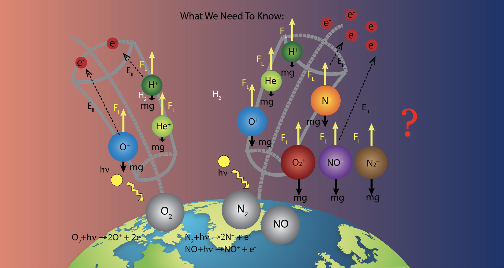
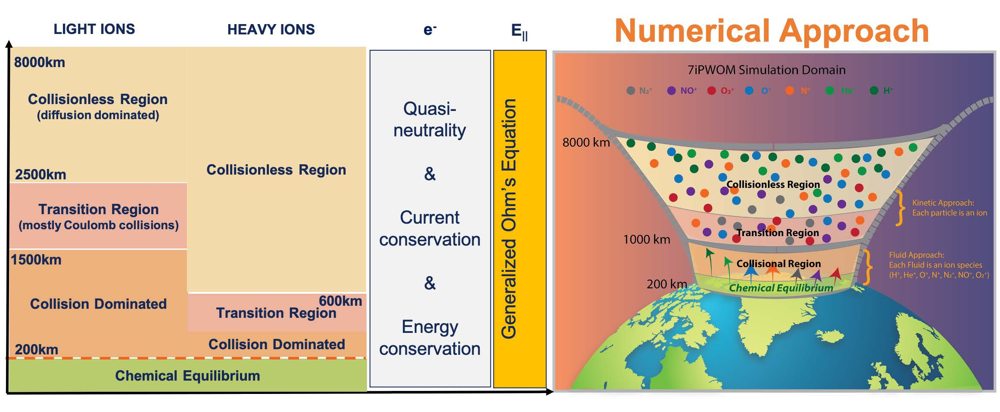

Research Interest
======
It is estimated that trillions of dollars, on the order of the gross domestic product of a large country, will be lost immediately after an extreme space weather event impacts the Earth. Space weather events involves drastic re-configurations of all current systems in the near-Earth space, with deleterious effects on engineering infrastructure, power grids, satellites, navigation systems, telecommunications, and more.

I study the dynamics of plasmas and electromagnetic fields in the Terrestrial environment, and in particular, the ionic component of our atmosphere, known as the ionosphere, as it responds to the energy input from the Sun. My research addresses the need to understand the physical mechanisms responsible for its acceleration from a subsonic to supersonic flow, and the altitude dependent transport, as this plasma experiences several physical regimes. For this, I am developing high-performance first-principles physics models capable to predict and describe the conditions in near Earth space.

In addition, these models are used to address open questions in Earth and Planetary science, and pave the path to new exploration endeavors. For instance, understating the loss and evolution of our atmosphere over geological times can place bounds and determine if, and under what conditions, Earth-like conditions for habitability can exist.

Develop Seven Ion Polar Wind Outflow Model (7iPWOM)
======

The Seven Ion Polar Wind Outflow Model (7iPWOM), developed from the Glocer et al. 2020 model (referred as 3iPWOM), solves for the polar wind solution for 7 ions (O⁺, H⁺, He⁺, O⁺, N⁺, NO⁺, O⁺, N⁺), as compared to 3 ion(O⁺, H⁺, He⁺) solution provided by the 3iPWOM. The inner boundary is set at 200 km altitude, where the atmosphere is assumed to be in chemical equilibrium, while the outer boundary is at few Earth radii. To account for the possible energization mechanisms to increase or decrease the kinetic energy of ions, the 7iPWOM adopts two different approaches: fluid treatment below 1000 km and kinetic approach above 1000 km.

Non-negligible N+ ions: ~ 2500 lbs of N+ lost a day
======

Numerical experiments by the 7iPWOM, designed to probe the influence of season, as well as that of solar conditions, suggest that N+ is a significant ion species in the polar ionosphere and its presence largely improves the polar wind solution, as compared to observations. This research has been published in [2020GL089321](https://agupubs.onlinelibrary.wiley.com/doi/full/10.1029/2020GL089321).

Ongoing Research: Transport of molecular ions in the polar wind
======

The presence of molecular ions upflows provides an important framework to understand the transport and acceleration mechanisms of molecular ions in the polar wind, including wave heating mechanisms. The 7iPWOM is the first and only polar wind model to have the capability to study the behavior of the heavy ions, other than O+, in the Earth’s ionospheric outflow. Preliminary simulations show that molecular ions can acquire sufficient energy via WPI to escape from the high latitude ionosphere. [This preliminary result](http://yilerat19.github.io/publication/2020-lin-essoar.10506554.1) has been presented in 2020 AGU and received the OSPA award.
