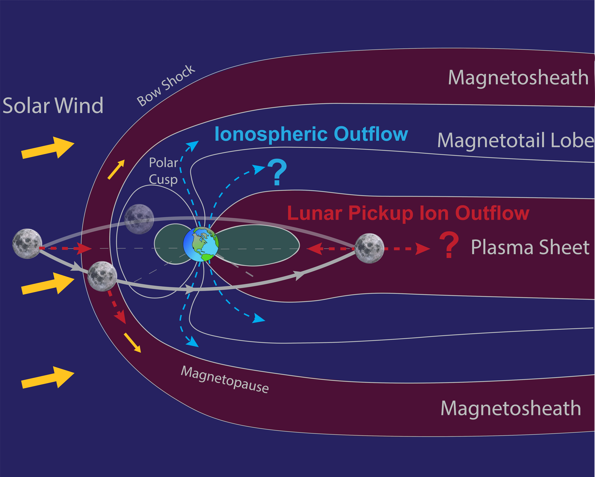

My research primarily focuses on studying the behavior of plasma and electromagnetic fields within the Earth's environment, particularly the ionic component of the magnetosphere-ionosphere plasma in response to solar energy input. The Sun continuously emits energetic plasma with a fluctuating magnetic field, profoundly influencing the plasma surrounding our planet. These space weather events can lead to significant financial losses and cause detrimental effects on engineering infrastructure, power grids, satellites, navigation systems, and telecommunications. Furthermore, the increasing deployment of spacecraft satellites around Earth, driven by advancements in spacecraft operation technology and the expanding space industry, presents opportunities for human exploration and the discovery of habitable environments during future space missions. My research aims to enhance our understanding of the resilience to space weather disruption and the impact of atmospheric escape on habitability and life.

<!--  -->

Resiliency to Space Weather Disruption
======================================

Space Weather on Earth
----------------------

The composition of plasma in the near-Earth environment plays a crucial role in regulating the impact of space weather events by influencing the dynamics and morphology of Earth's magnetosphere. Single-charge heavy ions, such as N+, O+, and molecular ions, originate from Earth's ionosphere and undergo energization mechanisms to escape to the magnetosphere, such as auroral electron precipitation from the magnetosphere, Joule heating, and interactions with low-frequency waves. However, due to the limitations of spacecraft instruments, the relative contribution of outflowing heavy ions and their transport mechanisms remains poorly understood. These energized heavy ions contribute to ionospheric outflow to the magnetosphere, leading to increased mass loading and altered energy flow in the magnetosphere. This, in turn, influences the effects of space weather disruptions on the terrestrial environment. To address this, I have developed an advanced first-principles model, the Seven ion Polar Wind Outflow Model (7iPWOM), which offers a comprehensive solution to Earth's ionospheric outflow by quantifying ion production and energization mechanisms. The presence of N$^+$, along with molecular ions and relevant neutral species, significantly impacts ionospheric chemistry and alters the composition of ionospheric outflow, aligning with observational data. In addition, the supply of heavy ions from the ionosphere differs by species and is regulated by the timescale of production and loss at lower altitudes, as well as the composition of the ionospheric plasma. Furthermore, despite their similar masses, N$^+$ and O$^+$ undergo distinct ionospheric chemical reactions and charge exchange processes, leading to different production and energization pathways in the magnetosphere-ionosphere coupling system.

In addition to ionospheric outflow, energetic heavy ion fluxes are intensified in the inner magnetosphere during space weather events. One specific population affected is the ring current, which intensifies during the main phase of a geomagnetic storm and then weakens during recovery. Similar to ionospheric outflow, heavy ions play major roles in determining the pressure and energy distributions of the ring current populations. The decay rate of the ring current and the subsequent recovery of a geomagnetic storm are primarily influenced by the losses of heavy N+ and O+ ring current ions. I have further developed the Hot Electron Ions Drift Integrator (HEIDI) model, a first-principles ring current model that considers the transport of both N+ and O+ ions in the inner magnetosphere. The presence of N+ ions leads to a faster recovery rate of a geomagnetic storm due to its larger charge exchange cross-sectional area with neutral H compared to O+ ions, implying that N+ and O+ ions contribute the loss of ring current in different spatial and temporal scales. 

Space Weather on the Moon and Beyond
------------------------------------

Studying space weather on the Moon has become increasingly critical due to recent advancements in the space industry and upcoming human exploration ARTEMIS missions. Similar to the terrestrial environment, heavy ions are also widespread near the Moon’s surface, mainly produced from the ionization of the lunar exosphere, a tenuous surface-bounded neutral atmosphere. These newly born heavy ions, so-called pickup ions, are immediately accelerated by either the solar wind or the magnetotail plasma, depending on the location of the Moon. The production and subsequent energization of these lunar pickup ions significantly impact lunar space weathering and the future operation of infrastructure. I combined the modeling effort of lunar pickup ions and observational data from THEMIS-ARTEMIS, a spacecraft mission measuring the in-situ lunar environment. The abundance of heavy lunar ions varies based on the Moon's position in its orbit and space weather disruptions. Additionally, heavy ions, such as silicon (Si) and aluminum (Al), with masses close to 28 amu, are crucial species among lunar pickup ions. When the Moon intersects the magnetosphere, these ions have the potential to circulate back and coexist with heavy ions outflowing from the ionosphere into the magnetosphere.

Impact of Atmospheric Escape on Habitability and Life
=====================================================

The Earth constitutes a uniquely habitable planetary body, and thus, understanding the loss and evolution of our atmosphere over geological times can place bounds and determine if and under what conditions Earth-like conditions for habitability can exist. One factor controlling atmospheric evolution is the particle escape of atmospheric constituents into space. The escape of the light H and He elements from the Earth's atmosphere can be explained by the thermal escape, while the additional acceleration mechanisms are required to explain the escape of heavy N and O elements. The Earth's magnetic field and solar activity have been suggested to play an important role in atmospheric escape since it regulates the interaction between the Earth and the solar wind. At present-day Earth, the geomagnetic field acts to prevent direct contact between the solar wind and the atmosphere, while for early Earth, the weak geomagnetic field could have facilitated atmospheric ablation through direct interaction between the solar wind and the atmosphere. In addition, solar activity also plays a key role in controlling atmospheric loss since it controls the energy deposited from the solar wind to the atmosphere. The PWOM model that I developed can be used to assess planetary atmosphere loss and explore the evaluation of the atmosphere on a habitable planet. The model's flexibility allows for the evaluation of atmospheric escape under various conditions, including in hydrogen-rich atmospheres and on M-dwarf planets. I found that the escape rates of nitrogen and oxygen elements significantly increase in high extreme ultraviolet (EUV) and hydrogen-rich environments. However, due to different charge exchange reactions with neutrals, O escape rates are more sensitive to EUV conditions and neutral atmosphere compositions than N escape rates.

Future Direction
================

Study of ionospheric outflow through the first-principles PWOM model can be further utilized to address open questions in Earth and Planetary science, leading to new exploration endeavors, specifically on how a planet develops and sustains a habitable atmosphere paves the path to new exploration endeavors, such as the search for life and the future of humanity's relationship with the space. I have been chosen as the Early Career Scientist Member of the international team of "How Heavy Elements Escape the Earth: Past, Present, and Implications to Habitability," selected by the International Space Science Institute (ISSI) in 2021--2022, and invited to present at Magnetism, Atmospheres, and Life (MAL) workshop. I have collaborated with experts from space sciences, planetary science, and paleomagnetism to understand how the heavy element escape is associated with habitable conditions. I have also served as an organization member at the NASA Eddy Symposium committee and Center for Integrative Planetary Science (CIPS) seminars at UC Berkeley to host symposiums, workshops, and seminars to foster discussions on planetary habitability. 