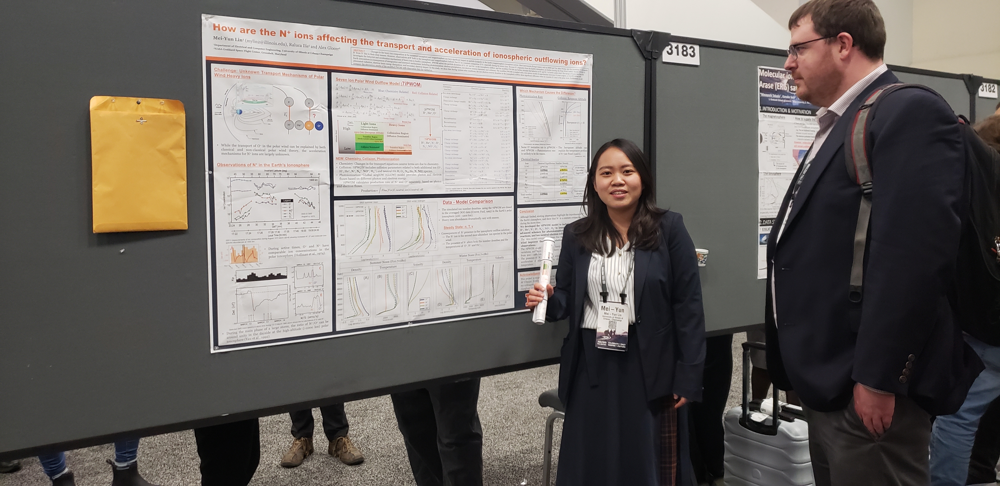



<a href="/talkmap.html">See a map of all the places I've given a talk!</a>



## Conference/Workshop Talks

_[V-GEM 2021]_ **M-Y. Lin**, R. Ilie, A. Glocer, S. Shong, H. Hu, **[N+: Gatekeepers of Ionospheric Outflow](https://yilerat19.github.io//talks/2021VGEM-lin)**

_[V-GEM 2021]_ S. Shong, R. Ilie, **M-Y. Lin**, H. Hu, [N+: A Possible Gatekeeper of Surface Water](https://yilerat19.github.io/talks/2021VGEM-Shong)

* [Appendix / Animation](https://yilerat19.github.io/posts/V-GEM2021_SS)

_[AGU 2020]_ **M-Y. Lin**, R. Ilie, A. Glocer, **[Revealing the role of “hidden heavy ions” component in the terrestrial polar wind outflow](https://yilerat19.github.io/talks/2020-lin-agu-oral)**

_[AGU 2020]_ **M-Y. Lin**, R. Ilie, A. Glocer, **[How do the nitrogen ions escape the Earth’s atmosphere?](https://yilerat19.github.io/talks/2020-lin-agu-poster)**

_[AGU 2019]_ **M-Y. Lin**, R. Ilie, A. Glocer, **[How are the N+ Ions Affecting the Transport and Acceleration of Ionospheric Outflowing Ions?](https://yilerat19.github.io/publication/2019-lin-agu-poster)**

## Invited Talks

_[National Central University, Taiwan]_ **M-Y. Lin**, R. Ilie, A. Glocer, **[Do “hidden heavy ions” play an important role in the polar wind study?](https://yilerat19.github.io/talks/2020-lin-ncu)**

_[Cold Plasma Workshop, Virtual]_ **M-Y. Lin**, R. Ilie, A. Glocer, **[The Role of Molecular Ions in the Overall Ionic Composition of Polar Wind Outflow](https://yilerat19.github.io/talks/2020ColdPlasmaWorkshop-lin)**

_[V-GEM 2020, Virtual]_ **M-Y. Lin**, **[VGEM Student Tutorial: Magnetosphere-Ionosphere-Thermosphere Coupling, Virtual GEM Workshop](https://yilerat19.github.io/talks/GEM-MITCoupling)**

<!---

  

-->
