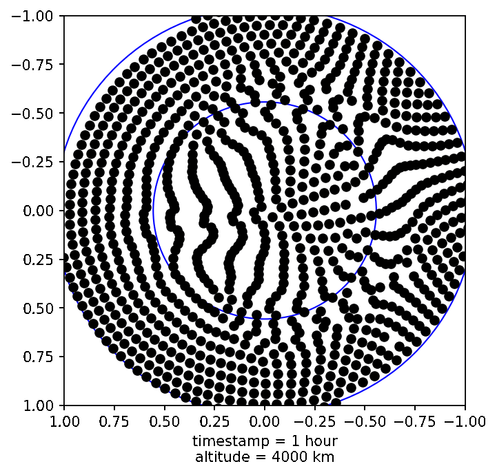
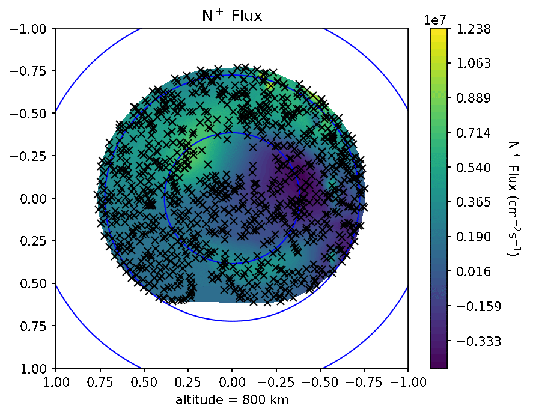
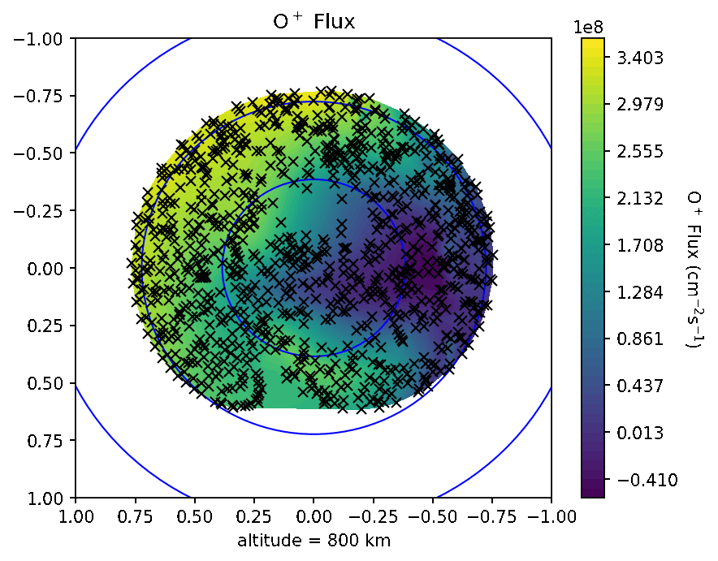
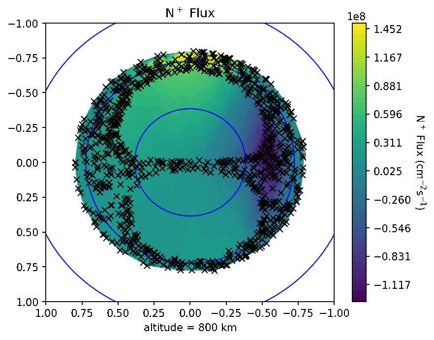
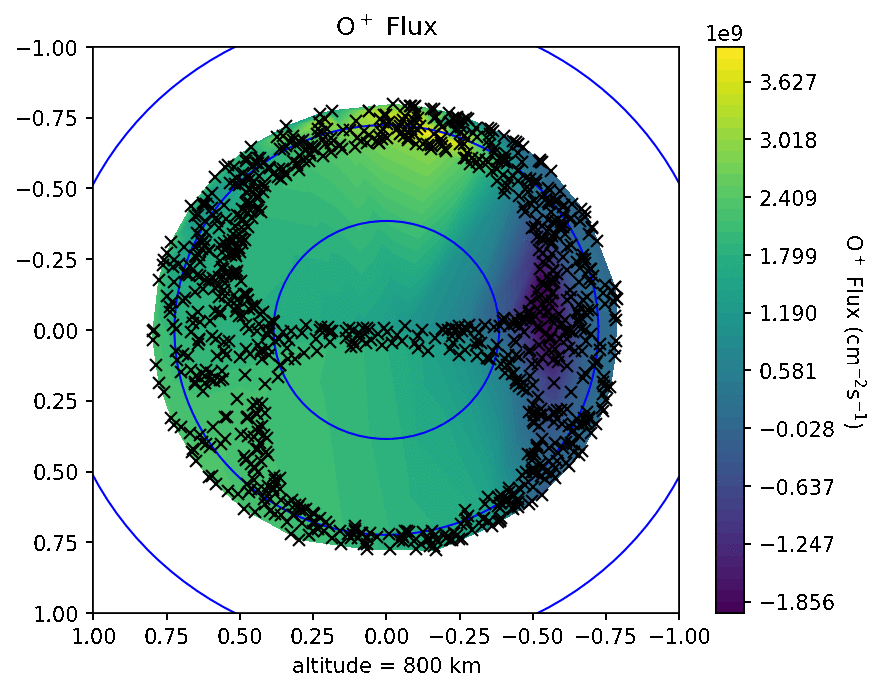

The Convection of Scenario 1 & 2

  
&nbsp; &nbsp; &nbsp; &nbsp;
  

Scenario 1: N+ and O+ Flux from 800 to 8000 km
======

  
&nbsp; &nbsp; &nbsp; &nbsp;
  

Scenario 2: N+ and O+ Flux from 800 to 8000 km
======

  
&nbsp; &nbsp; &nbsp; &nbsp;
  

------
