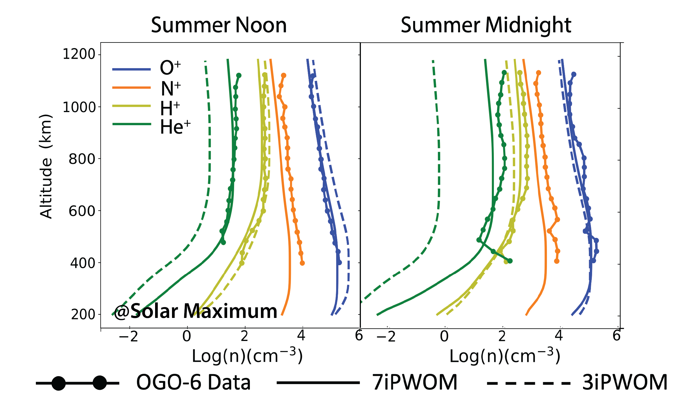

[Download poster here](https://www.essoar.org/doi/10.1002/essoar.10502057.1)

Changes in the heavy ion composition in the terrestrial ionosphere and magnetosphere can have significant impact on particle dynamics in the Earth’s magnetosphere-ionosphere system. Most instruments flying in space, such as MMS and Van Allen Probes, lack the possibility to distinguish N+ from O+ due to their close masses. However, observations of N+ both in the ionosphere and magnetosphere indicate that N+ is a constant companion of O+ , especially during the storm time. Because N+ originates from the Earth’s ionosphere, we further develop the Polar Wind Outflow Model (PWOM) to investigate the behavior and acceleration mechanisms of heavy ions in Earth’s ionosphere. The PWOM solves the particle dynamics of O+, H+ and He+ in the ionospheric outflow and the modified PWOM can further simulate the behavior of N+ and N2+ in Earth’s polar wind. The escape of heavy ions from the Earth atmosphere is consequences of energization and transport mechanisms, including photo ionization, electron precipitation, ion-electron-neutral chemistry and collisions. The modified PWOM is coupled with a two-stream model of superthermal electrons (GLobal airglow, or GLOW) to deal with attenuated radiation, electron beam energy dissipation, and secondary electron impact. In this study, we show that during various solar conditions, the ion-electron-neutral densities in the ionospheric outflow show significant difference when we consider N+ ions in the polar wind. Furthermore, we will compare the simulation results of the modified PWOM with observation data for validation.

Recommended citation: Lin, M.‐Y., Ilie, R., & Glocer, A. (2019). How are the N+ Ions Affecting the Transport and Acceleration of Ionospheric Outflowing Ions?. 2019 American Geophysical Union (AGU). https://www.essoar.org/doi/10.1002/essoar.10502057.1

