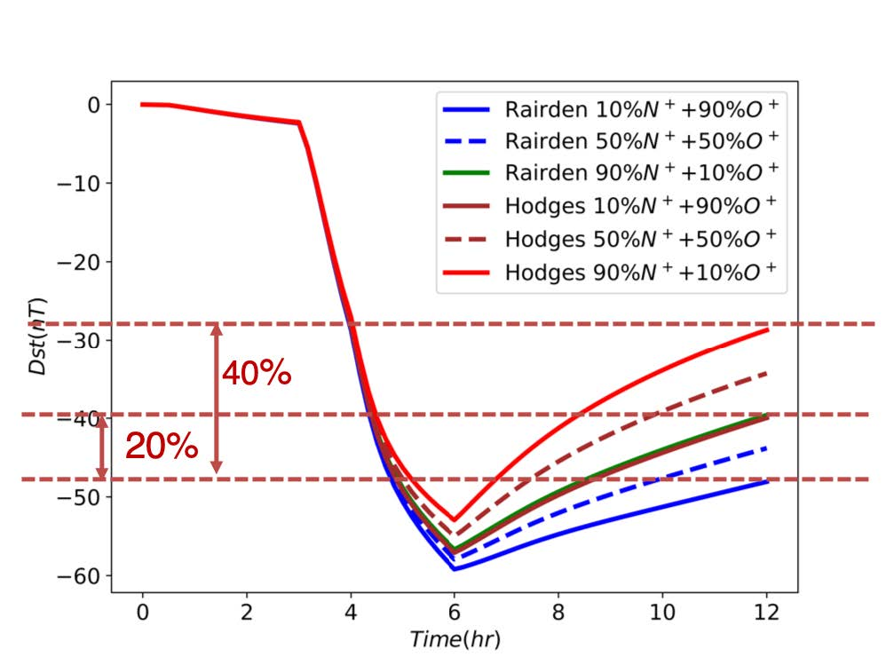

[Download the thesis](http://hdl.handle.net/2142/106274)

Changes in the heavy ion composition in the Earth’s terrestrial ionosphere and magnetosphere can have significant impacts on the particle dynamics in the Earth’s magnetosphere-ionosphere system. The contribution of N+ to the ring current population, in addition to that of O+, has long been neglected, primarily because most instruments flying in space could not distinguish between O+ and N+ due to their similar masses. For example, the magnetospheric missions, such as the Magnetospheric Multiscale Mission and the Van Allen Probes, cannot distinguish N+ from O+ because of their similar masses. However, the limited observations of N+ both in the ionosphere and magnetosphere indicate that N+ in the Earth’s magnetosphere and ionosphere is significant and a constant companion of O+, especially during the storm time. Moreover, the variation of the N+/O+ ratio depends on the solar condition. In spite of only 12% mass difference, N+ and O+ have different charge exchange cross sections with geocorona neutral H, especially at higher particle energies. Since the charge exchange collision constitutes the dominant mechanism of the decay of the ring current during the slow recovery phase of a geomagnetic storm, tracking the respective behaviors of N+ and O+ ions in the inner magnetosphere is required. We have already modified the Hot Electron Ion Drift Integrator (HEIDI) model, the ring current model, to account for the motion of N+ ions in the Earth’s ring current. In order to assess the contribution of N+ in the evolution of the ring current, we analyzed the behavior of N+ in the ring current with HEIDI in a synthetic storm simulation. The simulation results show that the N+ ions in the inner magnetosphere are lost at different rates than the energetic O+ ions because of different charge exchange cross section. Moreover, the presence of N+ in the ring current can impact the magnetospheric process, leading to a faster recovery rate of a geomagnetic storm.

Recommended citation: Lin, M.‐Y. & Ilie, R. (2019). Determining the role of neglected N+ heavy ions in the earth’s inner magnetosphere.

