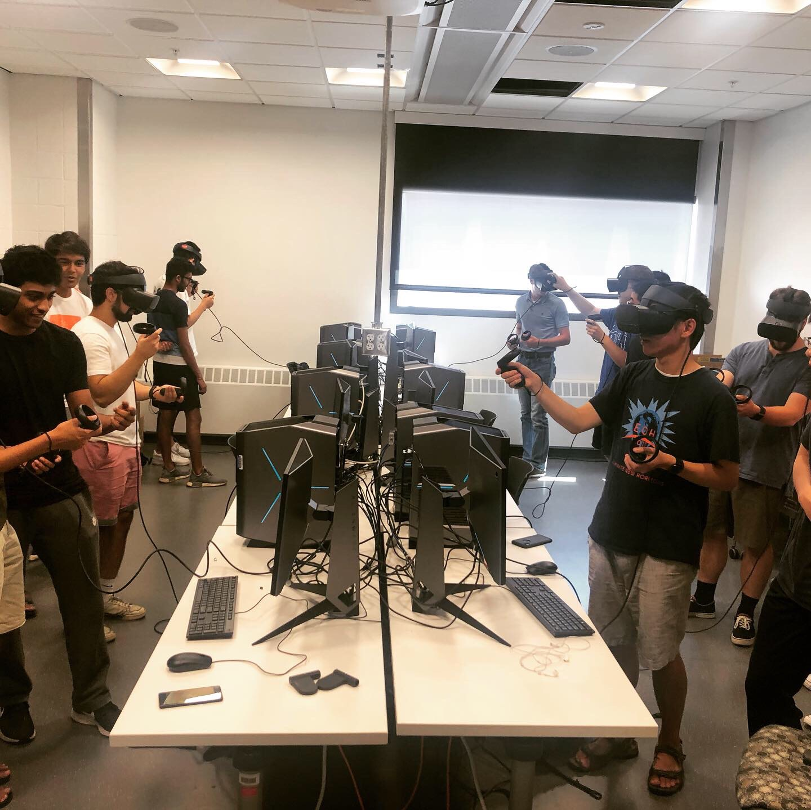

[Download paper here](https://peer.asee.org/38025)

A solid understanding of electromagnetic (E&M) theory is key to the education of electrical engineering students. However, these concepts are notoriously challenging for students to learn, due to the difficulty in grasping abstract concepts such as the electric force as an invisible force that is acting at a distance, or how electromagnetic radiation is permeating and propagating in space. Building physical intuition to manipulate these abstractions requires means to visualize them in a three-dimensional space. This project involves the development of 3D visualizations of abstract E&M concepts in Virtual Reality (VR), in an immersive, exploratory, and engaging environment.

The pilot VR Lab, introduced as an additional instructional tool for the E&M course during the Fall 2019, engaged over 100 students in the program, where in addition to the regular lectures, students attended one hour per week in the E&M VR lab. Student competencies around conceptual understanding of electromagnetism topics are measured via formative and summative assessments. To evaluate the effectiveness of VR learning, each lab is followed by a 10-minute multiple-choice test, designed to measure conceptual understanding of the various topics, rather than the ability to simply manipulate equations.

This paper discusses the implementation and the pedagogy of the Virtual Reality laboratory experiences to visualize concepts in E&M, with examples for specific labs, as well as challenges, and student feedback with the new approach. We will also discuss the integration of the 3D visualizations into lab exercises, and the design of the student assessment tools used to assess the knowledge gain when the VR technology is employed.

Recommended citation: Ilie, R., & Shaffer, E., & D'Angelo, C. M., & Cermak, D., & Lin, M., & Chen, H. (2021, July), Virtual Reality Laboratory Experiences for Electricity and Magnetism Courses Paper presented at 2021 ASEE Virtual Annual Conference Content Access, Virtual Conference. https://peer.asee.org/38025

