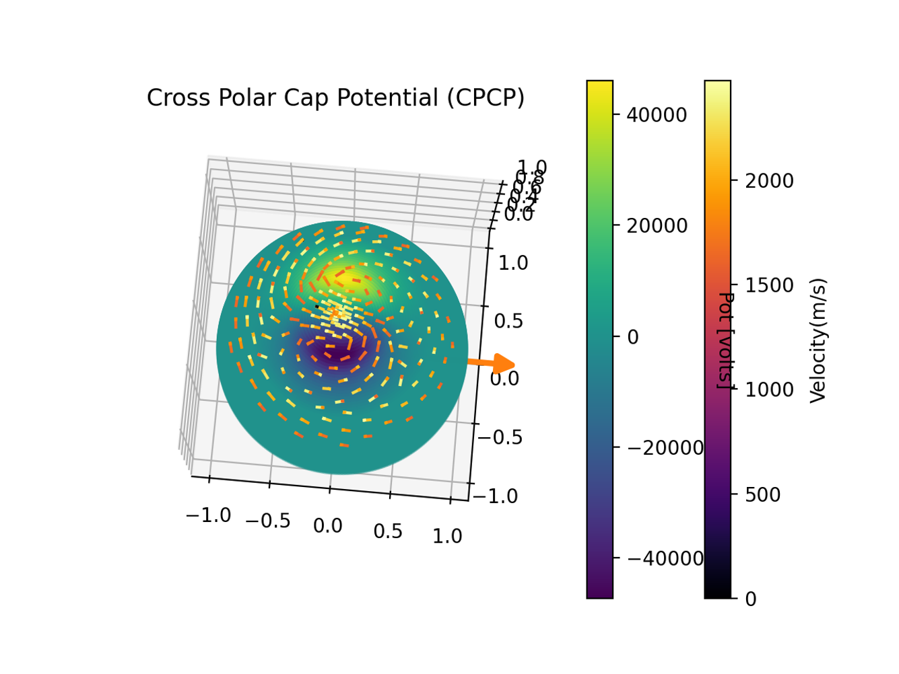

* Mentor, UIUC ECE undergraduate students [May 2020 - Present]
  * Mentored Student and Project:
    * Mentored ECE senior student (Shiru Shong) on the project of investigation the polar wind solution in various electrodynamic condition [Jan. 2021 - Present]
      * She published a poster in 2021 V-GEM. Please see the [poster](../talks/2021VGEM-Shong) and [animation](https://yilerat19.github.io/posts/V-GEM2021_SS) here.
    

    * Mentored ECE senior student (Isha Garg) on a project pertaining to the development of an user interface for the ENA map visualization [May 2020 - Nov. 2020]

<figure class="video_container">
<iframe width="560" height="315" src="https://www.youtube.com/embed/apYqqypx7QA" title="YouTube video player" frameborder="0" allow="accelerometer; autoplay; clipboard-write; encrypted-media; gyroscope; picture-in-picture" allowfullscreen></iframe>
</figure>
